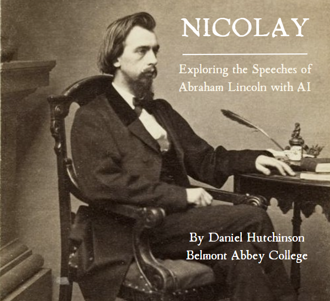

# Nicolay: Exploring the Speeches of Abraham Lincoln with AI

Nicolay is a digital history experiment that uses artificial intelligence to explore the speeches of Abraham Lincoln. The app is named after John George Nicolay, a German-born American author and diplomat who served as the private secretary to US President Abraham Lincoln.

## Contents

- [Summary](#summary)
- [Who was Nicolay](#who-was-nicolay)
- [Data Source](#data-source)
- [Methods](#methods)
- [How to Use](#how-to-use)
- [Acknowledgements](#acknowledgements)
- [License](#license)

## Summary

Nicolay utilizes large language models to analyze 15 of Lincoln's most important speeches, totaling around 96,000 words or 300 pages of text. The app allows users to explore a substantial collection of Lincoln's ideas, rhetoric, and important moments in the nation's history.

## Who was Nicolay

[John George Nicolay](https://en.wikipedia.org/wiki/John_George_Nicolay) was a German-born American author and diplomat who served as the private secretary to US President Abraham Lincoln. Nicolay collaborated with his fellow Lincoln secretary, John Hay, to compose a 10-volume biography of Lincoln's life. Their substantial research played an important role in the future scholarship of the life and times of Lincoln. This app has been named
Nicolay to honor his role in documenting and preserving the words and legacy of Abraham Lincoln for future generations.

## Data Source

The project relies on the speeches of Abraham Lincoln produced and curated by the University of Virginia's [Miller Center](https://millercenter.org/). Their [corpus of presidential speeches](https://millercenter.org/presidential-speeches-downloadable-data) is an important primary source for studying American history.

## Methods

Nicolay uses several methods and technologies for text analysis, including:

- Semantic search using text embeddings with OpenAI's [Ada](https://openai.com/blog/new-and-improved-embedding-model) model
- OpenAI's large language models [ChatGPT](https://openai.com/blog/chatgpt) and [GPT-4](https://openai.com/research/gpt-4)
- Python libraries [Streamlit](https://streamlit.io/) and [langchain](https://github.com/hwchase17/langchain)

Users can explore Lincoln's speeches through semantic search and the "Ask Nicolay" feature, which allows them to pose questions to the AI models.

## How to Use

You can access Nicolay by visiting [Honest Abe's Information Emporium](https://honestabes.info/fireside-chats/), a digital history project developed as part of the inaugural [Digital Literacy Accelerator](https://tech.ed.gov/dla/) program offered by the U.S. Department of Education (2021-2022) and supported by a team of faculty at the University of Texas-San Antonio.

## Acknowledgements

Thanks to the Miller Center at the University of Virginia for preserving and maintaining the collection of presidential speeches, which serve as the data source for this project, and to [Dr. Abraham Gibson](http://history.utsa.edu/faculty/gibson-abe) at the University of Texas-San Antonio for the opportunity to contribute to Honest Abe's Information Emporium.
